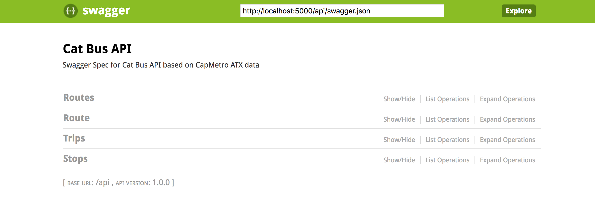

# Cat Bus API 🚌


Simple API wrapper for Austin's Capmetro GTFS data.

## Stack

1. Python 3
1. Docker handles standing up the MySQL database and Flask app
1. Flask server handles API requests
1. Swagger defines API and provides a UI for exploring the API
1. PeeWee is a lightweight Python ORM I used to make it easier to model and query data
1. Pandas is a package for Python I like using for manipulating CSV data

## Set up

This API requires [Docker](https://www.docker.com) to run locally.

1. `docker-compose build && docker-compose up` to build and bring up the project.
1. From the root directory, `pip install -r requirements.txt`. This pretty much only installs Pandas and PeeWee, which is needed to backfill data in the MySQL database.
1. Run the backfill: `python backfill.py`. Note: Backfilling stops, routes, and trips is pretty fast, but stop times will take a while. Drink some tea. 🍵

## Run the server

The API server is a Flask app that uses the Swagger spec. Using `docker-compose up` should bring up both the database and the Flask app.

1. The Flask app and API should be running on [localhost:5000](http://localhost:5000)
1. You should be able to curl the API on `http://localhost:5000/api` or use an app like [POSTMAN](https://www.getpostman.com/), or the Swagger UI link below.

## Swagger



Go to [http://localhost:5000/api/ui/](http://localhost:5000/api/ui/) on  your browser to check out the spec and make test calls!

## Challenges

* I was using MySQL version 8, but I had some compatibility issues being able to connect Flask to the MySQL 8 version of the DB due to how MySQL hashes passwords now. Articles I found online suggested downgrading to MySQL 5.
* On the password note, I usually do use a password for databases, but due to the issue I was having connecting Flask to MySQL, I decided not to use one for this project. That said, my typical approach to database passwords is to set them up as environment variables on the container.

## Database design and queries

### Design

I thought about what I wanted to do with the data, and while I'm not sure if putting the txt files in a database was a requirement for the challenge, I decided to do so, because I knew this data would be very interrelated, and I knew I would have an easier time working with the data with a database.

I tried to mimick the txt files as much as possible in my database, and I made some decisions I probably wouldn't have made with what I know now :)

For example, when I wrote my SQL schema, I decided to name route IDs as `route_id` everywhere, even in the routes table. This means that now I have `routes.route_id` instead of `routes.id`. I made that decision to remain consistent with the nomenclature of the txt files, but in retrospect, I would change that in the future to the more standard SQL practice of `table.id`.

### Queries

I usually have fun constructing SQL queries. I used an ORM to make it easier for me to backfill data into the database, and then just stuck to using it, since it is a pretty easy and lightweight ORM. 

I usually run a query on MySQL, see what data I get, then figure out how to do that in the ORM. Here are all the queries I'm making in the API:

#### List routes

Routes.select().limit(LIMIT).offset(OFFSET)

MYSQL:

```
select * from routes limit X OFFSET X
```

#### Get a route

Routes.select().where(Routes.route_id == ID)

MYSQL:

```
select * from routes where route_id = ID
```

#### List all trips for a route

Trips.select().where(Trips.route_id == ID)

MYSQL:

```
select * from trips where route_id = ID
```

#### List stops by trip ID

This was tricker to do in the ORM than in pure SQL!

```
(Stop_Times
        .select(Stop_Times, Stops, Trips)
        .join(Stops, on=(Stop_Times.stop_id == Stops.stop_id).alias('stop'))
        .switch(Stop_Times)
        .join(Trips, on=(Stop_Times.trip_id == Trips.trip_id).alias('trip'))
        .where(Stop_Times.trip_id == trip_id, Trips.route_id == route_id).limit(limit).offset(offset))
```

MYSQL:

```
select arrival_time, departure_time, stops.stop_id, stops.stop_name, stop_times.trip_id, trips.trip_headsign from stop_times inner join stops on stop_times.stop_id = stops.stop_id inner join trips on stop_times.trip_id = trips.trip_id  where stop_times.trip_id = ID;
```